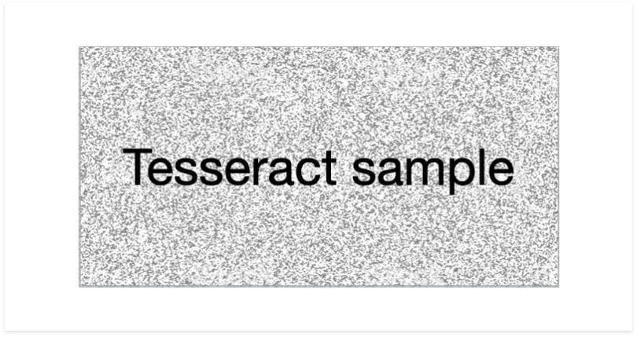
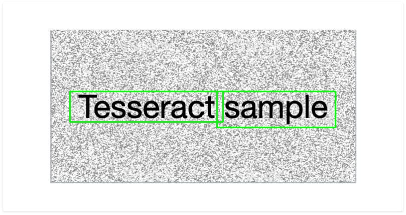

# AI-Powered OCR Scanner with C++ Speedup 🚀

This project is a hybrid OCR pipeline that combines the **speed of C++** (for image preprocessing and text detection) with the **flexibility of Python** (for OCR and NLP postprocessing). It can handle scanned documents, noisy images, and even handwritten text.

---

## 🔧 Features

- 🧠 **C++ Preprocessing (OpenCV):**
  - Grayscale conversion
  - Noise removal
  - Morphological text region detection
  - Contour filtering with padding
  - Bounding box export

- 🐍 **Python OCR + NLP:**
  - Text extraction using `pytesseract`
  - Smart cleanup (spacing, punctuation)
  - Spell correction using `TextBlob`
  - Optional CSV export

---

## 🖼️ Example Output

**Input:**


**Output (boxed):**


**Extracted Text:**
[1] Box(...) → 'Tesseract'
[2] Box(...) → 'sample'

---

## 🗂️ Folder Structure

```text
SmartOCR/
├── cpp/ # C++ source files
│ └── preprocess.cpp
├── python/ # Python glue + OCR
│ ├── ocr_runner.py
│ └── nlp_postprocess.py
├── build/ # CMake output (DLL + exe)
├── test_images/ # Input images
├── output/ # Debug images and results
└── README.md
```

---

## ⚙️ Installation

### 1. Prerequisites

- OpenCV (C++ build)
- CMake + Ninja or MSVC
- Python 3.x
- Tesseract-OCR installed and added to `PATH`

### 2. Python Packages

```bash
pip install opencv-python pytesseract textblob nltk
python -m textblob.download_corpora
```

---

## 🧠 TODO / Future Work
Handwriting-friendly OCR tuning

NLP-based field classification (Name, Date, ID)

Batch mode support for folders

Flask/Tkinter GUI frontend

PDF input / output support

## 📜 License
MIT License © 2025 Harry Yang